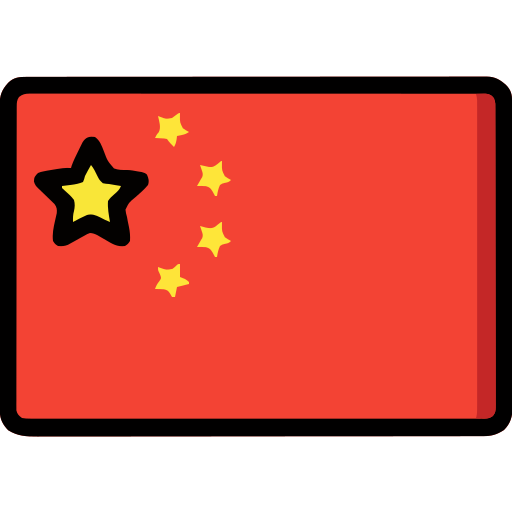
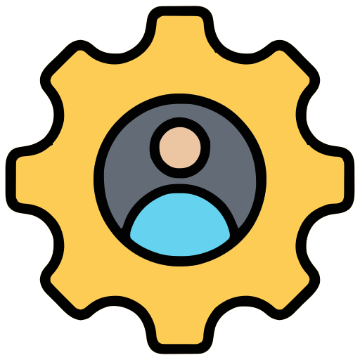
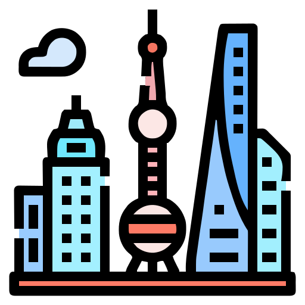

  
  

This <i>README</i> file is generated <b>every 24 hours</b>!

---

  

  I'm Peng, a JAVA programmer from  <b>China</b>.

<h2 align="center">💻 My Coding Toolkit</h2>

  
  
  
  
  
  
  
  
  
  
  
  
  
  
  
  
  
  

<h2 align="center">📂 Open Source Projects</h2>
<table align="center">
  <thead align="center">
  <tr>
    <th>
      
      Projects
    </th>
    <th>⭐ Stars</th>
    <th>📚 Forks</th>
    <th>🛎 Issues</th>
    <th>📬 Pull requests</th>
  </tr>
  </thead>
  <tbody>
  <tr>
    <td><a href="https://cityuhk.cn"><b>CityU GuideBook</b></a></td>
    <td></td>
    <td></td>
    <td></td>
    <td></td>
  </tr>
  <tr>
    <td><a href="https://press.ocademy.cc/intro.html"><b>Machine Learning</b></a></td>
    <td></td>
    <td></td>
    <td></td>
    <td></td>
  </tr>
  </tbody>
</table>

<h2 align="center">📊 My GitHub Stats</h2>

  
  
  
  
<!--  -->
<!--  -->
<!--  -->
<!--  -->
<!--  -->
<!--  -->

<h2 align="center">🏙 Welcome to  Shanghai !</h2>
<ul align="center">
  <strong>Temperature:</strong> 5°C 
  <strong>Weather:</strong> 阴 
  <strong>Wind:</strong> 东风, 1 km&#x2F;h 
</ul>

<h2 align="center">🌟 Where to find me</h2>

  
  
<!--  <a href="weixin://dl/chat?todo204" target="_blank">-->
<!--    -->
<!--  </a>-->
  

<!--
-->
<!--  If you like what I do, maybe consider buying me a coffee 👉👈-->
<!--
-->
<!--
-->
<!--  <a href="https://buymeacoffee.com/penjc" target="_blank">-->
<!--    -->
<!--  </a>-->
<!--
-->